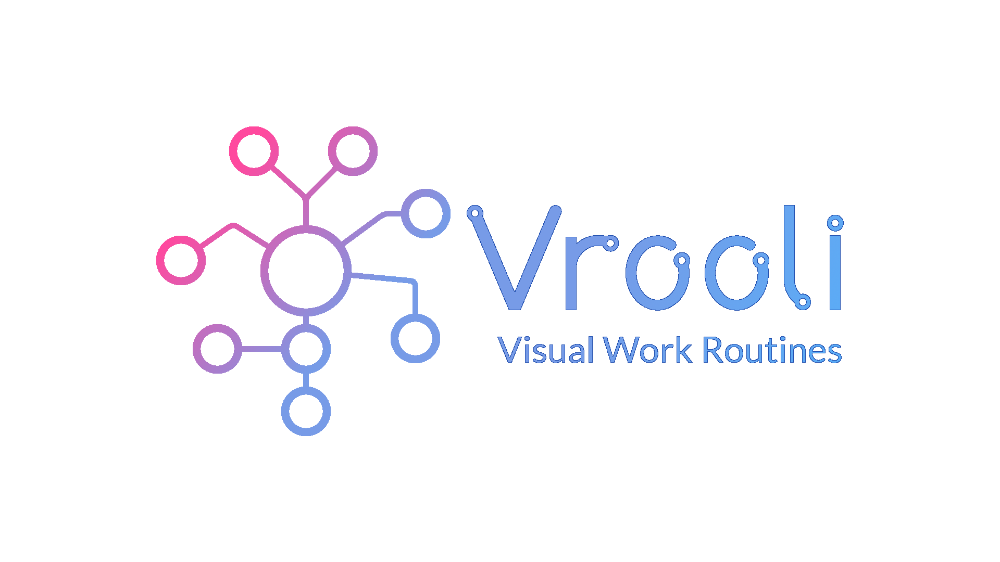

[
    

        
    

][website]

[][landing]
[][youtube]
[][twitter]
[][discord]
[][start]

This is the source code for the landing site for Vrooli. You're probably looking for [the main application](https://github.com/MattHalloran/Vrooli).

[landing]: https://vrooli.com
[website]: https://app.vrooli.com
[start]: https://app.vrooli.com/start
[discord]: https://discord.com/invite/VyrDFzbmmF
[twitter]: https://twitter.com/intent/follow?original_referer=https%3A%2F%2Fgithub.com%2FVrooliOfficial&screen_name=VrooliOfficial
[youtube]: https://www.youtube.com/channel/UC4qvcwbFxx06vBD3wKjXscg